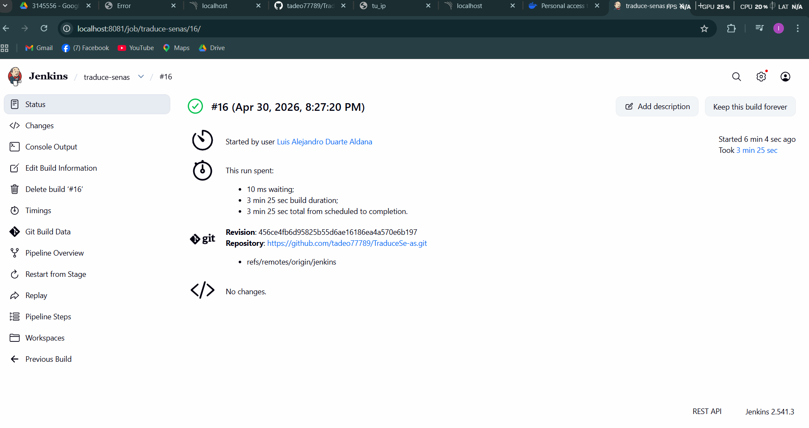

# Configuración del Pipeline CI/CD con Jenkins

Este documento describe la implementación del pipeline de integración y despliegue continuo (CI/CD) del proyecto **Traduce Señas**, los problemas encontrados durante la configuración y cómo se resolvieron.

---

## 1. Arquitectura del entorno

Todo el stack corre en contenedores Docker orquestados con Docker Compose:

| Servicio | Imagen | Puerto host | Descripción |
|---|---|---|---|
| `traduce-senas-jenkins` | `jenkins/jenkins:lts-jdk17` | 8081 | Servidor Jenkins |
| `traduce-senas-sonar` | `sonarqube:lts-community` | 9000 | Análisis de calidad de código |
| `traduce-senas-backend` | `desarrolloaplicativo-backend` | 3000 | API Node.js / Express |
| `traduce-senas-frontend` | `desarrolloaplicativo-frontend` | 8080 | App Expo Web (Nginx) |
| `traduce-senas-db` | `postgres:16-alpine` | 5432 | Base de datos PostgreSQL |

El contenedor de Jenkins monta el socket Docker del host (`/var/run/docker.sock`) para poder construir y publicar imágenes desde dentro del pipeline (Docker-out-of-Docker).

---

## 2. Etapas del pipeline

El `Jenkinsfile` define las siguientes etapas en orden:

1. **Checkout** — Clona el repositorio desde GitHub (shallow clone)
2. **Instalar Dependencias - Backend** — `npm install` del backend
3. **Instalar Dependencias - Frontend** — `npm install` del frontend
4. **Análisis SonarQube** — Escaneo de calidad de código
5. **Quality Gate** — Espera el resultado del análisis (aborta si falla)
6. **Login Docker Hub** — Autenticación contra Docker Hub
7. **Build Docker - Backend** — Construye la imagen del backend
8. **Build Docker - Frontend** — Construye la imagen del frontend
9. **Push a Docker Hub** — Publica las imágenes en Docker Hub
10. **Deploy a Kubernetes** *(opcional)* — Solo se ejecuta si `kubectl` está disponible

---

## 3. Errores encontrados y soluciones

Durante la puesta en marcha del pipeline se presentaron cuatro errores. A continuación se documenta cada uno con su causa raíz y la solución aplicada.

### Error #1 — `401 Unauthorized` al descargar imagen base de Docker Hub

**Síntoma observado en el log de Jenkins:**

```
ERROR: failed to solve: failed to fetch oauth token:
unexpected status from GET request to
https://auth.docker.io/token?scope=repository%3Alibrary%2Fnode%3Apull
&service=registry.docker.io: 401 Unauthorized
```

**Stage que falló:** `Build Docker - Backend`

**Causa raíz:**
Docker Hub aplica límites de descarga (rate limiting) a usuarios anónimos. El stage `Build Docker - Backend` ejecutaba `docker build` (que requiere descargar `node:20-alpine` como imagen base) **antes** del stage `Push a Docker Hub`, donde estaba el `docker login`. Es decir, el pipeline intentaba descargar imágenes sin estar autenticado.

**Solución aplicada:**
Se creó un nuevo stage llamado **`Login Docker Hub`** ubicado antes de los stages de Build:

```groovy
stage('Login Docker Hub') {
    steps {
        withCredentials([usernamePassword(
            credentialsId: 'docker-hub',
            usernameVariable: 'DOCKER_USER',
            passwordVariable: 'DOCKER_PASS'
        )]) {
            sh 'echo $DOCKER_PASS | docker login -u $DOCKER_USER --password-stdin'
        }
    }
}
```

Adicionalmente se generó un **Personal Access Token (PAT)** en Docker Hub con permisos `Read & Write` y se registró en Jenkins → Credentials con el ID `docker-hub`.

---

### Error #2 — Timeout al clonar el repositorio (10 min)

**Síntoma observado en el log de Jenkins:**

```
ERROR: Timeout after 10 minutes
fatal: fetch-pack: invalid index-pack output
error: git-remote-https died of signal 15
ERROR: Error cloning remote repo 'origin'
```

**Stage que falló:** `Declarative: Checkout SCM`

**Causa raíz:**
Jenkins por defecto hace un **clon completo** del repositorio (toda la historia, todas las ramas, todos los tags). El repositorio había crecido a más de 25 MB de objetos y, combinado con velocidades de descarga lentas (a veces 9-12 KiB/s), no terminaba dentro del timeout configurado de 10 minutos. Además, como el pipeline ejecuta `cleanWs()` al final de cada build, el clon se hace desde cero cada vez.

**Solución aplicada:**
Se modificó el Jenkinsfile para usar **shallow clone** (sólo el último commit, sin historia):

```groovy
options {
    skipDefaultCheckout(true)
}

stages {
    stage('Checkout') {
        steps {
            checkout([
                $class: 'GitSCM',
                branches: [[name: '*/jenkins']],
                extensions: [[
                    $class: 'CloneOption',
                    shallow: true,
                    depth: 1,
                    noTags: true
                ]],
                userRemoteConfigs: [[url: 'https://github.com/tadeo77789/TraduceSe-as.git']]
            ])
        }
    }
}
```

Cambios clave:
- `skipDefaultCheckout(true)` evita el clon automático que Jenkins hace antes de los stages
- `shallow: true, depth: 1` descarga sólo el último commit (no toda la historia)
- `noTags: true` no descarga los tags

Resultado: el checkout pasó de fallar a los 10 minutos a completarse en segundos.

---

### Error #3 — Permisos denegados sobre el socket Docker

**Síntoma observado en el log de Jenkins:**

```
ERROR: permission denied while trying to connect to the Docker daemon socket
at unix:///var/run/docker.sock: Head "http://%2Fvar%2Frun%2Fdocker.sock/_ping":
dial unix /var/run/docker.sock: connect: permission denied
```

**Stage que falló:** `Build Docker - Backend`

**Causa raíz:**
Inspeccionando dentro del contenedor:

```bash
$ docker exec traduce-senas-jenkins sh -c 'ls -la /var/run/docker.sock && id jenkins'
srw-rw---- 1 root root 0 Apr 30 18:03 /var/run/docker.sock
uid=1000(jenkins) gid=1000(jenkins) groups=1000(jenkins),102(docker)
```

El socket pertenece a `root:root` con permisos `660` (sólo dueño y grupo pueden leer/escribir). El usuario `jenkins` está en el grupo `docker` (gid 102) **pero no en `root`**, por lo que no podía acceder al socket. Curiosamente, `docker login` funcionó porque ese comando sólo escribe credenciales a un archivo de configuración local; en cambio `docker build` sí necesita comunicarse con el daemon a través del socket.

**Solución aplicada:**
Se cambiaron los permisos del socket a `666` (lectura/escritura para todos):

```bash
docker exec -u root traduce-senas-jenkins sh -c 'chmod 666 /var/run/docker.sock'
```

> **Nota:** Esta solución es temporal. Si Docker Desktop reinicia, el socket recupera sus permisos por defecto. Para una solución permanente habría que recrear el contenedor de Jenkins con la GID del grupo `docker` del host.

---

### Error #4 — `kubectl: not found`

**Síntoma observado en el log de Jenkins:**

```
+ kubectl set image deployment/traduce-senas-backend
  backend=luisduarte86/traduce-senas-backend:15 --record
/var/jenkins_home/workspace/...: 2: kubectl: not found
```

**Stage que falló:** `Deploy a Kubernetes`

**Causa raíz:**
El contenedor de Jenkins (`jenkins/jenkins:lts-jdk17`) no incluye `kubectl` por defecto, y para este entorno académico no se cuenta con un cluster de Kubernetes configurado.

**Solución aplicada:**
Se agregó una cláusula `when` al stage para que sólo se ejecute si `kubectl` está disponible en el sistema. Si no lo está, el stage se marca como **skipped** y el pipeline finaliza exitosamente.

```groovy
stage('Deploy a Kubernetes') {
    when {
        expression {
            return sh(
                script: 'command -v kubectl >/dev/null 2>&1',
                returnStatus: true
            ) == 0
        }
    }
    steps {
        sh """
            kubectl set image deployment/traduce-senas-backend \\
                backend=${DOCKER_IMAGE_BACKEND} --record
            kubectl set image deployment/traduce-senas-frontend \\
                frontend=${DOCKER_IMAGE_FRONTEND} --record
            kubectl rollout status deployment/traduce-senas-backend
            kubectl rollout status deployment/traduce-senas-frontend
        """
    }
}
```

De esta forma el pipeline es portable: en un entorno con cluster de Kubernetes el deploy se ejecuta automáticamente; en un entorno sin cluster se omite sin marcar el build como fallido.

---

## 4. Resumen del resultado final

Tras aplicar todas las correcciones, el pipeline finaliza exitosamente con la siguiente ejecución:

| Stage | Estado |
|---|---|
| Checkout | ✅ Exitoso |
| Instalar Dependencias - Backend | ✅ Exitoso |
| Instalar Dependencias - Frontend | ✅ Exitoso |
| Análisis SonarQube | ✅ Exitoso |
| Quality Gate | ✅ OK |
| Login Docker Hub | ✅ Exitoso |
| Build Docker - Backend | ✅ Imagen `luisduarte86/traduce-senas-backend:15` |
| Build Docker - Frontend | ✅ Imagen `luisduarte86/traduce-senas-frontend:15` |
| Push a Docker Hub | ✅ Imágenes publicadas |
| Deploy a Kubernetes | ⏭️ Skipped (kubectl no disponible) |

---

## 5. Cómo levantar el entorno

### Encender los servicios

```bash
docker start traduce-senas-jenkins traduce-senas-sonar \
            traduce-senas-backend traduce-senas-frontend traduce-senas-db
```

### Aplicar el fix temporal del socket Docker (si fuera necesario)

```bash
docker exec -u root traduce-senas-jenkins sh -c 'chmod 666 /var/run/docker.sock'
```

### URLs disponibles

- **Jenkins:** http://localhost:8081
- **SonarQube:** http://localhost:9000
- **Frontend:** http://localhost:8080
- **Backend API:** http://localhost:3000

### Disparar el pipeline

1. Entrar a Jenkins en http://localhost:8081
2. Seleccionar el job `traduce-senas`
3. Hacer clic en **Build Now**

---

## 6. Credenciales requeridas en Jenkins

| ID de credencial | Tipo | Uso |
|---|---|---|
| `docker-hub` | Username/Password (PAT) | Login y push a Docker Hub |

El PAT de Docker Hub se genera en https://app.docker.com/settings/personal-access-tokens con permisos `Read & Write`.

---

## 7. Repositorios e imágenes generadas

- **Repositorio fuente:** https://github.com/tadeo77789/TraduceSe-as
- **Rama del pipeline:** `jenkins`
- **Imágenes publicadas en Docker Hub:**
  - `luisduarte86/traduce-senas-backend:<BUILD_ID>`
  - `luisduarte86/traduce-senas-frontend:<BUILD_ID>`

---

## 8. Evidencia de ejecución exitosa


